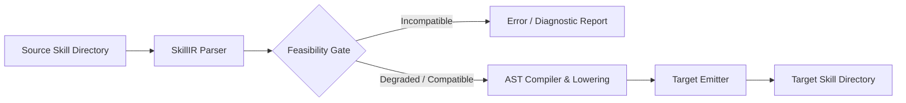
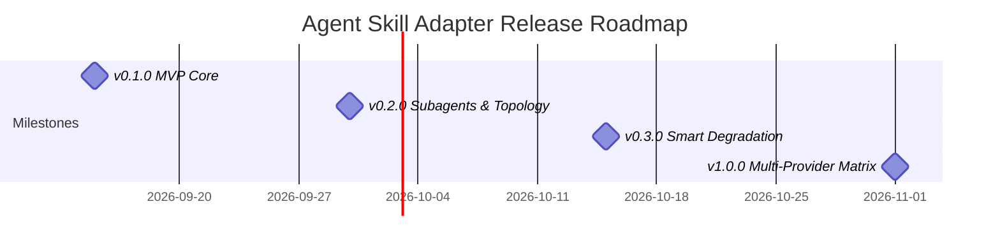

# PRD-001: Agent Skill Adapter

| Metadata | Details |
| :--- | :--- |
| **Document ID** | PRD-001 |
| **Title** | Agent Skill Adapter — Universal Skill Compiler & Transpiler |
| **Status** | Active / Approved |
| **Author** | PRGate Core Engineering Team |
| **Created** | 2026-09-11 |
| **Target Version** | v0.1.0 (MVP) — v1.0.0 (Production Multi-Provider) |
| **Methodology** | BMAD (Breakthrough Method for Agile AI-Driven Development) |

---

## 1. Executive Summary & North Star

### 1.1 The North Star
> **"Babel for AI Agent Skills: Write for Claude, Run Everywhere."**

`agent-skill-adapter` is a universal, deterministic, offline compiler and transpiler designed to bridge disparate AI agent skill formats. By compiling source skills into a typed **Skill Intermediate Representation (SkillIR)** and lowering them onto target platform dialects, the adapter eliminates vendor lock-in across the modern multi-agent ecosystem.

### 1.2 Problem Statement
The contemporary AI agent ecosystem is fragmented across competing skill specifications (e.g., Anthropic Claude, Google Antigravity, OpenAI Assistants, OpenHands, and IDE-native agents). Each framework mandates distinct directory topologies, frontmatter schemas, tool naming conventions, parameter semantics, and subagent orchestration syntax.

As a consequence:
- **Ecosystem Fragmentation**: Skill developers must rewrite and maintain parallel versions of their agent skills for each target platform.
- **Context Drift & Vibe Coding**: Ad-hoc, manual translation leads to semantic divergence, broken file links, and unverified tool invocations.
- **Enterprise Friction**: Multi-agent enterprise platforms cannot reliably port battle-tested internal skills between developer environments and production agent fleets without automated verification.

### 1.3 Solution Overview
`agent-skill-adapter` provides an end-to-end compiler pipeline:
1. **Parser & IR Extraction**: Ingests source skill bundles (markdown AST, YAML frontmatter, XML tool tags, supporting assets) into a strictly validated `SkillIR`.
2. **Feasibility Gate**: Matches skill capability requirements against target provider specifications, classifying conversions as `COMPATIBLE`, `COMPATIBLE_WITH_DEGRADATION`, or `INCOMPATIBLE`.
3. **AST Compiler & Rewriter**: Deterministically rewrites tool signatures, dialect-specific XML/Markdown syntax, and polyfills missing primitives with explanatory decorators.
4. **Target Emitters**: Generates native file trees, re-anchors relative asset links, and synthesizes multi-agent topologies (e.g., Google Antigravity subagents and workflows).
5. **Developer CLI & CI Gates**: Offers non-destructive `plan`, `convert`, and `check` CLI commands for local development and CI pipelines.

---

## 2. Target Personas & Stakeholders

| Persona | Role | Key Goals & Needs | Pain Points Addressed |
| :--- | :--- | :--- | :--- |
| **Skill Author** | Individual or OSS agent skill developer | Write a skill once (e.g. in Anthropic Claude format) and distribute it across Google Antigravity, OpenHands, and other agent platforms. | Eliminates manual porting and dual-maintenance overhead. |
| **Platform Engineer** | Multi-agent infra engineer | Integrate heterogeneous third-party skills into enterprise agent topologies with automated CI validation. | Prevents silent failures, schema incompatibilities, and broken tool calls. |
| **Enterprise AI Ops** | Security, Compliance, and DevOps Lead | Enforce deterministic, offline compilation with strict typing, zero runtime overhead, and explicit degradation auditing. | Guarantees reproducible builds and eliminates untrusted runtime execution or external network calls. |

---

## 3. User Journeys & Core Scenarios



### 3.1 Scenario 1: Pre-Flight Feasibility Planning (`plan`)
- **Actor**: Skill Author inspecting migration feasibility before making changes.
- **Action**: Runs `agent-skill-adapter plan ./my-claude-skill --target google`.
- **Experience**:
  - The CLI parses the source skill and evaluates target capability support.
  - A Rich terminal report (or JSON/Markdown export) details tool compatibility, degraded syntax, and missing platform primitives without touching the disk.
  - The developer reviews explicit degradation warnings (e.g., unsupported XML parameters mapped to prompt directives).

### 3.2 Scenario 2: Deterministic Batch / Single Conversion (`convert`)
- **Actor**: Platform Engineer migrating a skill library to Google Antigravity format.
- **Action**: Runs `agent-skill-adapter convert ./my-claude-skill --target google --out ./dist/my-antigravity-skill`.
- **Experience**:
  - Validates source skill integrity.
  - Generates complete destination directory structure (`SKILL.md`, scripts, subagents, asset bundles).
  - Re-anchors relative links (e.g., `references/` and `scripts/`).
  - Creates backup files (`.bak`) when operating in in-place overwrite mode.

### 3.3 Scenario 3: Continuous Integration Quality Gate (`check`)
- **Actor**: CI/CD Runner validating Pull Requests in a central skills repository.
- **Action**: Executes `agent-skill-adapter check ./skills/* --target google --strict`.
- **Experience**:
  - Runs in non-interactive mode.
  - Exits with `code 0` if all skills meet compatibility criteria.
  - Exits with `code 1` (or `code 2` on syntax violation) if any skill encounters unresolvable `INCOMPATIBLE` capabilities under strict mode.

### 3.4 Scenario 4: Programmatic Python SDK Integration
- **Actor**: Enterprise Developer building custom skill deployment tooling.
- **Action**: Embeds `agent_skill_adapter` as a Python library.
- **Code Workflow**:
  ```python
  from agent_skill_adapter.ir.parser import parse_skill
  from agent_skill_adapter.feasibility.gate import FeasibilityGate
  from agent_skill_adapter.compiler.engine import SkillCompiler
  from agent_skill_adapter.emitters.google import GoogleAntigravityEmitter

  skill_ir = parse_skill("./skills/data-analyst")
  gate = FeasibilityGate(target="google")
  verdict = gate.evaluate(skill_ir)

  if verdict.is_transpilable:
      compiled_ir = SkillCompiler(target="google").compile(skill_ir)
      GoogleAntigravityEmitter(output_path="./build/google").emit(compiled_ir)
  ```

---

## 4. Functional Requirements

### 4.1 Module Breakdown

```
src/agent_skill_adapter/
├── cli/              # Typer/Rich CLI interface (plan, convert, check)
├── specs/            # Provider capability schemas & contract loaders
├── ir/               # SkillIR data models, Markdown AST & XML parser
├── feasibility/      # Capability matcher, degradation rules, reporters
├── compiler/         # AST lowering engine, tool rewriters, polyfills
└── emitters/         # Target file system generators & packagers
```

### 4.2 Detailed Functional Specifications

| ID | Component | Requirement Description |
| :--- | :--- | :--- |
| **FR-001** | **Provider Specs & Contracts** | Maintain declarative YAML/JSON schemas in `specs/<provider>/` and explicit cross-provider contracts in `contracts/<source>-to-<target>/`. |
| **FR-002** | **Frontmatter & Markdown AST Parser** | Ingest source `SKILL.md`, extract YAML frontmatter (name, description, parameters, tools), and build a CommonMark AST preserving code blocks and formatting. |
| **FR-003** | **XML Tag & Tool Call Extractor** | Parse dialect-specific XML elements (e.g. `<thinking>`, `<function_calls>`, `<context>`, `<rules>`) and map them into typed `SkillIR` node representations. |
| **FR-004** | **Skill Intermediate Representation (SkillIR)** | Pydantic v2 data model capturing metadata, instructions AST, tool definitions, subagent topology, script bindings, and referenced asset manifests. |
| **FR-005** | **Feasibility Gate Engine** | Compare `SkillIR` requirements against target provider capability registries; output structured verdicts (`COMPATIBLE`, `COMPATIBLE_WITH_DEGRADATION`, `INCOMPATIBLE`). |
| **FR-006** | **Multi-Format Feasibility Reporter** | Render feasibility analysis in human-friendly Rich terminal output, GitHub Flavored Markdown tables, or machine-readable JSON. |
| **FR-007** | **Deterministic AST Rewriter** | Transform Markdown AST nodes, normalize dialect idioms, rewrite tool signature invocations, and inject markdown admonitions/warnings. |
| **FR-008** | **Tool Signature Lowering** | Map tool call signatures (e.g., Anthropic `bash` $\to$ Google `run_command`, `str_replace_editor` $\to$ `replace_file_content`) including argument transformations. |
| **FR-009** | **Capability Polyfill Injector** | Where exact 1:1 tool parity is absent, inject deterministic polyfill prompts or warning decorators guiding the target runtime model. |
| **FR-010** | **Target Emitters (Google Antigravity)** | Serialize compiled `SkillIR` into native Google Antigravity workspace structure (`SKILL.md`, `scripts/`, `examples/`, `references/`). |
| **FR-011** | **Subagent & Slash Command Emitters** | Convert nested agent definitions and command triggers into target-supported subagent declarations and slash command hooks. |
| **FR-012** | **Asset Packager & Link Re-Anchorer** | Detect all local relative file references in instructions and copy/re-anchor paths relative to the generated target root. |
| **FR-013** | **CLI Suite (`plan`, `convert`, `check`)** | Provide intuitive CLI subcommands with `--target`, `--out`, `--strict`, `--format`, `--dry-run`, and interactive confirmation prompts. |

---

## 5. Capability Translation Matrix & Degradation Policies

### 5.1 Three-Tier Compatibility Classification
1. **`COMPATIBLE`**: Complete 1:1 lossless semantic mapping. Target platform natively supports the capability.
2. **`COMPATIBLE_WITH_DEGRADATION`**: Capability supported with transformed syntax, argument lowering, or injected polyfill guidance.
3. **`INCOMPATIBLE`**: Target platform cannot support the capability (e.g. proprietary runtime features). Triggers hard failure in `--strict` mode.

### 5.2 Core Tool & Dialect Mapping Matrix (Anthropic Claude $\to$ Google Antigravity)

| Source Primitive (Anthropic) | Target Primitive (Google Antigravity) | Classification | Transformation Details |
| :--- | :--- | :--- | :--- |
| `bash` / `bash_20241022` | `run_command` | `COMPATIBLE` | Map `command` parameter to `CommandLine`. Inject working directory context (`Cwd`). |
| `str_replace_editor` (`view`) | `view_file` | `COMPATIBLE` | Map `path` $\to$ `AbsolutePath`, convert slice line numbers to `StartLine` / `EndLine`. |
| `str_replace_editor` (`create`) | `write_to_file` | `COMPATIBLE` | Map `path` $\to$ `TargetFile`, `file_text` $\to$ `CodeContent`, set `Overwrite=True`. |
| `str_replace_editor` (`str_replace`) | `replace_file_content` | `COMPATIBLE` | Map `old_str` $\to$ `TargetContent`, `new_str` $\to$ `ReplacementContent`. |
| `grep` / Search tools | `grep_search` / `find_by_name` | `COMPATIBLE` | Translate regex and glob parameters to Antigravity arguments. |
| `web_search` | `search_web` | `COMPATIBLE` | 1:1 parameter mapping (`query` $\to$ `query`). |
| `fetch_web_page` | `read_url_content` | `COMPATIBLE` | Map `url` $\to$ `Url`. |
| Subagents / Task delegation | `invoke_subagent` | `COMPATIBLE_WITH_DEGRADATION` | Lower subagent role definitions and instructions into Antigravity subagent invocation format. |
| User clarification dialogs | `ask_question` | `COMPATIBLE` | Convert structured question prompts and multi-choice options to `ask_question` schema. |
| Custom Proprietary Sandboxing | Custom Antigravity Rules / Tools | `INCOMPATIBLE` | Flagged as incompatible unless explicit custom contract polyfill is provided. |

### 5.3 Degradation Policies
- **Syntactic Admonition Injection**: When an XML tag or prompt directive cannot be natively translated into target frontmatter, it is lowered into a standard Markdown alert block (e.g. `> [!NOTE]`).
- **Unsupported Parameter Pruning**: Optional parameters absent in target tool signatures are pruned, and a warning comment is appended to the generated AST.
- **Fail-Fast Safety**: Under `--strict` or in CI `check` mode, any `INCOMPATIBLE` feature immediately halts compilation with an actionable error trace.

---

## 6. Non-Functional Requirements (NFRs)

| ID | Category | Requirement & Constraint |
| :--- | :--- | :--- |
| **NFR-001** | **Performance & Latency** | Process and compile standard skill bundles (<50 files, <10MB) in **< 3.0 seconds** total execution time on standard developer hardware. |
| **NFR-002** | **100% Deterministic Execution** | The compilation process must be completely deterministic: identical source skill inputs must produce byte-for-byte identical output files on every run. |
| **NFR-003** | **Zero Network / Offline Guarantee** | Compilation and feasibility checking require zero network calls. All provider specifications and contracts are bundled locally. |
| **NFR-004** | **Zero Runtime Overhead** | Transpilation is static and ahead-of-time. Generated target skills are native directories requiring zero adapter runtime dependencies. |
| **NFR-005** | **Strict Type Safety (PEP 561)** | 100% type-annotated codebase passing `mypy --strict`. Distributes `py.typed` marker for downstream library consumers. |
| **NFR-006** | **Cross-Platform Compatibility** | Native path resolution and line-ending normalization across Linux, macOS, and Windows. |
| **NFR-007** | **Non-Destructive Operations** | File system writes use atomic operations. Overwrites require explicit confirmation or `--force` flag, maintaining automated `.bak` rollback points. |

---

## 7. Release Milestones & Delivery Roadmap



### 7.1 Release Milestone Breakdown

1. **v0.1.0 — MVP Core (Foundations & Single Skill Transpilation)**
   - Core `SkillIR` Pydantic models.
   - Frontmatter YAML and Markdown AST parser.
   - Provider spec store for Anthropic Claude and Google Antigravity.
   - Single-file `SKILL.md` compilation and tool signature lowering.
   - Basic CLI: `plan`, `convert`, `check`.

2. **v0.2.0 — Commands & Subagents (Multi-Agent Topology)**
   - Subagent extraction and Google Antigravity subagent topology generator.
   - Slash command parsing and emitter.
   - Multi-file asset packaging, dependency tracking, and relative link re-anchoring.
   - Golden Master snapshot testing harness.

3. **v0.3.0 — Smart Degradation & Polyfills (Resilience & Hardening)**
   - Automated capability degradation policy engine.
   - Polyfill injector for parameter discrepancies and unsupported tag annotations.
   - Invariant linters and forbidden token checkers.
   - Chaos and malformed input test suite.

4. **v1.0.0 — Multi-Provider Matrix (Enterprise Ready)**
   - Bidirectional transpilation (Google Antigravity $\to$ Anthropic Claude).
   - Additional target providers (OpenHands, OpenAI Assistant format, Cursor rules).
   - Plugin architecture for third-party contract extensions.
   - Production-grade benchmark suite.

---

## 8. Risks, Mitigations & Non-Goals

### 8.1 Risks and Mitigations
- **Risk: Upstream Provider Divergence**: Fast-evolving tool schemas across agent platforms could break static contracts.
  - *Mitigation*: Versioned, declarative contract schemas (`contracts/`) separated from core compiler engine logic.
- **Risk: Semantic Loss during Lowering**: Subtle prompt instructions or XML nuances lost during AST transformation.
  - *Mitigation*: Fallback to non-destructive markdown admonitions (`> [!NOTE]`) and automated warning decorators.
- **Risk: Path Manipulation Vulnerabilities**: Malicious skills with `../` traversal in asset links.
  - *Mitigation*: Strict path confinement verification in the asset packager to prevent directory traversal outside target output boundaries.

### 8.2 Non-Goals
- **Runtime Agent Execution**: `agent-skill-adapter` is a static build-time compiler, not an agent runtime or LLM execution engine.
- **Dynamic Prompt Optimization**: Does not invoke LLMs at compile time to "rephrase" or rewrite prompt text (preserves deterministic offline guarantees).
- **Architecture Decision Records**: Tracked separately under `docs/adr/` (MADR framework, Issue #37).

---

## 9. Traceability & Acceptance Sign-off

| Requirement Area | Verification Method | Acceptance Evidence |
| :--- | :--- | :--- |
| **BMAD Structure & Completeness** | Automated doc integrity test | `tests/unit/test_docs_integrity.py` |
| **Deterministic Transpilation** | Golden master AST snapshots | Snapshot regression tests (Epic #31) |
| **CLI Functionality** | Unit & E2E CLI tests | Typer CliRunner test suite (Epic #27) |
| **Type Safety & Code Quality** | Static analysis pipeline | `make check` (`ruff`, `mypy --strict`, `pytest`) |
